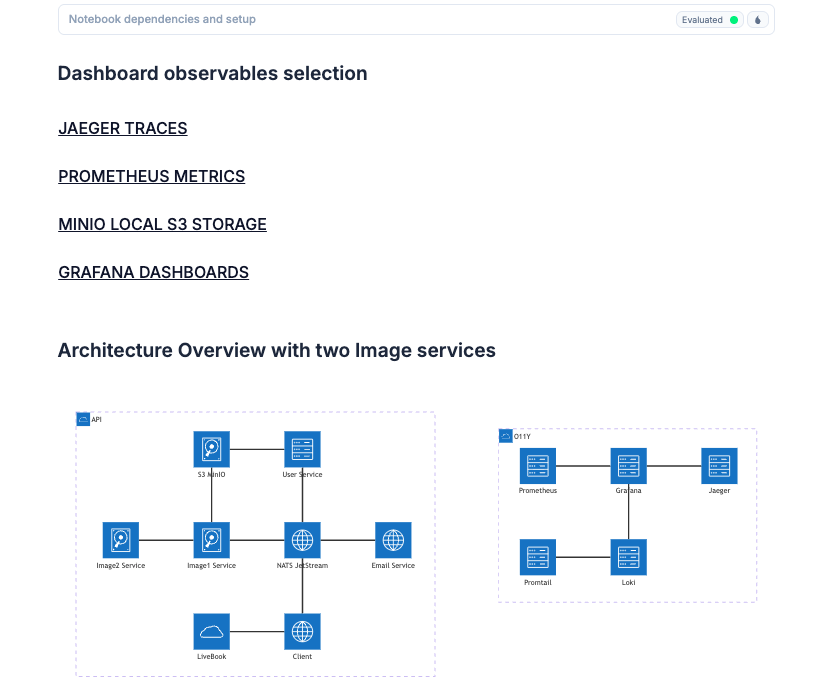
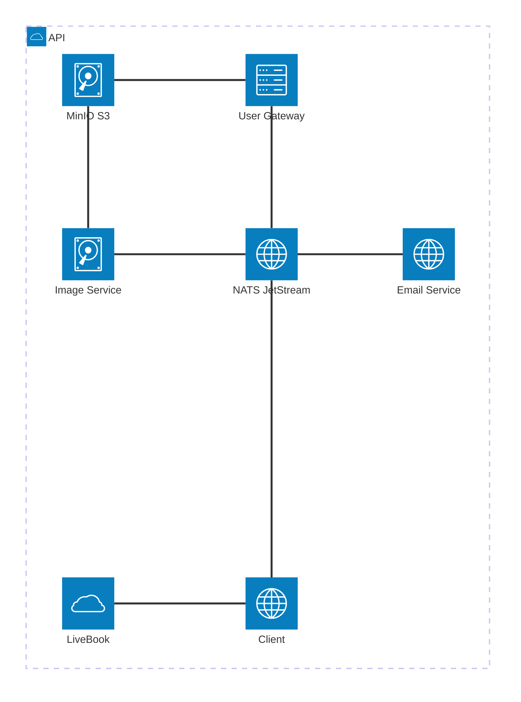
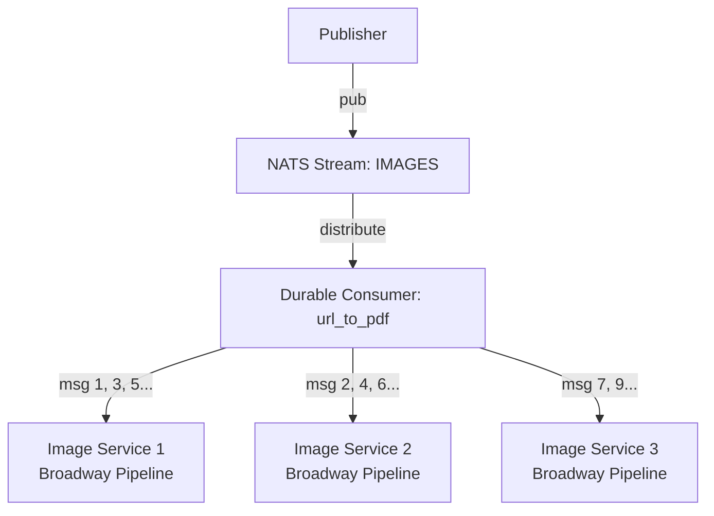
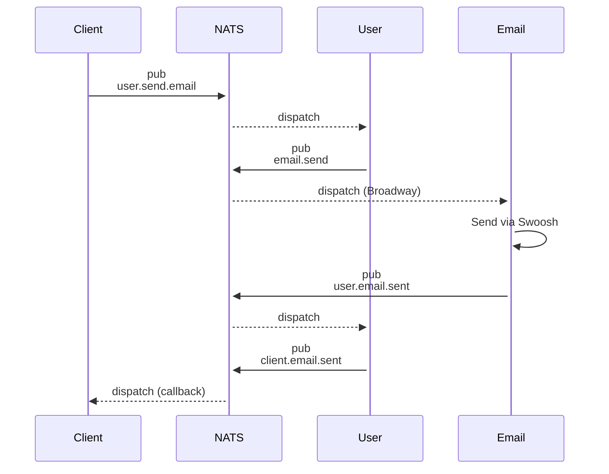
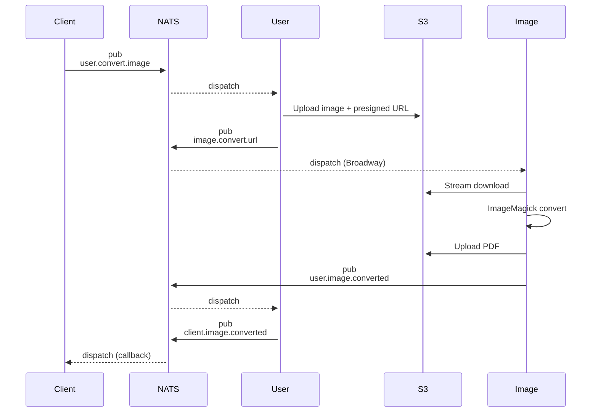
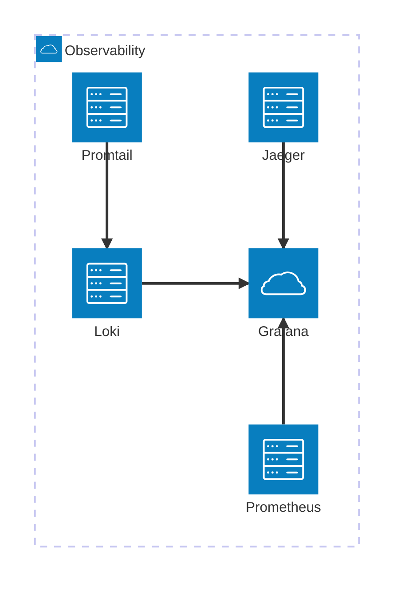
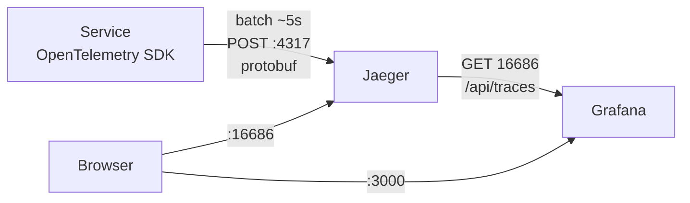

# Microservices with Elixir, NATS JetStream, and Observability

A **Phoenix/Elixir microservices** proof-of-concept addressing three core challenges:

1. **Service Communication**: Event-driven architecture with NATS JetStream and Broadway
2. **Debugging Distributed Systems**: Full observability with OpenTelemetry (traces, logs, metrics)
3. **Failure Handling**: Message durability, automatic retries, and load balancing via JetStream

We demonstrate both CPU-intensive (PNG-to-PDF conversion with S3 streaming) and I/O-bound (email sending) workloads.

**What we DON'T cover**: Data consistency (sagas, event sourcing), deployment orchestration beyond `docker-compose`, or service discovery (service mesh).

**Key Technologies**: NATS JetStream, Broadway, MinIO (local S3), Protobuf, OpenTelemetry, Prometheus, Loki, Grafana, Jaeger

---

## About NATS.io


NATS is a lightweight messaging platform providing:

- **Pub/Sub messaging** between services
- **Load-balanced queues** across multiple instances of a service
- **Message replay** on failure or cache rebuilding

**Elixir libraries**: [gnat](https://hexdocs.pm/gnat/readme.html) (core NATS), [jetstream](https://hexdocs.pm/jetstream/overview.html) (persistence layer)

**Can JetStream replace Oban?**:

**Short answer**: No, they solve different problems. Use both.

**JetStream ⭐️**:

- **Service-to-service messaging**: When service A needs to tell service B something happened
- **Fire-and-forget tasks**: Send an email, resize an image, process a webhook
- **High-throughput workloads**: Processing thousands of events per second across multiple servers
- **Event replay**: Need to rebuild a cache? Replay all past events

**Oban ⭐️**:

- **Business-critical jobs**: Billing, payments, subscription renewals
- **Scheduled/recurring jobs**: "Send invoice on the 1st of each month"
- **Jobs that need retries with complex rules**: "Retry 3 times, then notify admin"
- **Jobs that must run exactly once**: Database-backed uniqueness prevents duplicates

**Why not JetStream for critical jobs?**

JetStream lacks:

- **Database-backed guarantees**: Postgres transactions, unique constraints, ACID compliance
- **Advanced job management**: Dashboard, job status tracking, scheduled/cron jobs
- **Complex retry policies**: Exponential backoff, max attempts per job, custom retry logic
- **Idempotency**: Deduplication based on unique job parameters (Oban does this via DB constraints)
- **Auditability**: Full job history with timestamps and state transitions

**What JetStream does better than Oban**:

- **Free horizontal scaling**: Add more servers, get automatic load balancing (no Postgres bottleneck)
- **Message replay**: Your cache service crashed? Replay all past events to rebuild it
- **High throughput**: Handle 10,000+ messages/sec across multiple servers easily

**Example: Message Replay for Cache Rehydration**:

```elixir
# Create a consumer that replays ALL messages from the beginning
%{
  stream_name: "IMAGES",
  durable_name: "cache_rehydrator",
  deliver_policy: :all,          # Start from the first message
  replay_policy: :instant,       # Deliver as fast as possible (not :original timing)
  ack_policy: :explicit
}
```

**Real-world decision guide**:

| What you're building                | Use this  | Why                                                               |
| ----------------------------------- | --------- | ----------------------------------------------------------------- |
| Send welcome email after signup     | JetStream | If it fails, retry is fine. Don't need exactly-once               |
| Charge customer's credit card       | Oban      | Must run exactly once. Need audit trail                           |
| Resize uploaded images              | JetStream | High volume, can process across many servers                      |
| Send monthly invoice (1st of month) | Oban      | Needs cron scheduling                                             |
| Process webhook from Stripe         | JetStream | Fast, async, can replay if service was down                       |
| Upgrade user to paid plan           | Oban      | Database transaction required (update user + create subscription) |
| Rebuild analytics cache             | JetStream | Replay all past events to recalculate everything                  |

---

## Running the Demo

This demo runs on **Docker** with **Livebook** for interactive exploration.

**Features**:

- All services are Erlang-distributed (you can use `:erpc.call/4` from Livebook to reach any service)
- Observability UIs accessible in browser (see [SERVICES.md](SERVICES.md) for port mappings)
- Livebook provides a code runner and custom UI to access observability dashboards

> [!NOTE]
> **Security**: This demo uses unencrypted TCP without authentication (JWT) and runs behind Caddy reverse proxy on port 8080. In production, enable TLS and NATS authentication.


---

## Table of Contents

- [Microservices with Elixir, NATS JetStream, and Observability](#microservices-with-elixir-nats-jetstream-and-observability)
  - [About NATS.io](#about-natsio)
  - [Running the Demo](#running-the-demo)
  - [](#)
  - [Table of Contents](#table-of-contents)
  - [Architecture Overview](#architecture-overview)
  - [The Problem](#the-problem)
  - [What This Demo Covers](#what-this-demo-covers)
    - [Architecture Patterns](#architecture-patterns)
    - [Observability (OpenTelemetry)](#observability-opentelemetry)
    - [Technologies](#technologies)
  - [Prerequisites](#prerequisites)
    - [System Requirements](#system-requirements)
  - [Quick Start](#quick-start)
  - [Services Overview](#services-overview)
    - [Client Service (port 8085)](#client-service-port-8085)
    - [User Service (port 8081)](#user-service-port-8081)
    - [Email Service (port 8083)](#email-service-port-8083)
    - [Image Service (port 8084)](#image-service-port-8084)
  - [NATS JetStream + Broadway](#nats-jetstream--broadway)
    - [Why JetStream?](#why-jetstream)
    - [Setting Up Streams](#setting-up-streams)
    - [Broadway Pipelines](#broadway-pipelines)
    - [Load Balancing with Multiple Service Instances](#load-balancing-with-multiple-service-instances)
      - [How It Works](#how-it-works)
      - [Client Pull Model (Broadway with OffBroadway.Jetstream.Producer)](#client-pull-model-broadway-with-offbroadwayjetstreamproducer)
      - [Server Push Model (Gnat.ConsumerSupervisor with Queue Groups)](#server-push-model-gnatconsumersupervisor-with-queue-groups)
      - [Demo: Running 2 Image Service Instances](#demo-running-2-image-service-instances)
      - [Important Configuration Notes](#important-configuration-notes)
      - [When to Use Which Model?](#when-to-use-which-model)
    - [Pub/Sub Patterns](#pubsub-patterns)
  - [Message Flow Examples](#message-flow-examples)
    - [Email Notification Flow](#email-notification-flow)
    - [Image Conversion Flow](#image-conversion-flow)
  - [Storage Management](#storage-management)
    - [MinIO/S3 Integration](#minios3-integration)
    - [Automatic Cleanup](#automatic-cleanup)
  - [Protobuf Contracts](#protobuf-contracts)
    - [Centralized Proto Compilation](#centralized-proto-compilation)
    - [Example Proto Definition](#example-proto-definition)
    - [Encode/Decode Pattern](#encodedecode-pattern)
  - [OpenTelemetry Distributed Tracing](#opentelemetry-distributed-tracing)
    - [Setup](#setup)
    - [Trace Context Propagation](#trace-context-propagation)
    - [Span Links for Async Flows](#span-links-for-async-flows)
  - [Observability Stack](#observability-stack)
    - [Traces (Jaeger)](#traces-jaeger)
    - [Logs (Loki + Promtail)](#logs-loki--promtail)
    - [Metrics (Prometheus + PromEx)](#metrics-prometheus--promex)
    - [Dashboards (Grafana)](#dashboards-grafana)
  - [Production Considerations](#production-considerations)
    - [Scaling Strategies](#scaling-strategies)
    - [Observability in Production](#observability-in-production)
    - [Security](#security)
    - [Reliability](#reliability)
  - [Testing Strategy](#testing-strategy)
    - [Test Pyramid](#test-pyramid)
    - [Manual Testing](#manual-testing)
  - [Sources](#sources)
    - [Broadway \& GenStage](#broadway--genstage)
    - [NATS JetStream](#nats-jetstream)
    - [OpenTelemetry](#opentelemetry)
    - [Observability](#observability)
    - [Protobuf](#protobuf)

---

## Architecture Overview



**Event-Driven Communication**: Services communicate asynchronously via NATS JetStream subjects:

- `user.*` - User operations (create, convert images)
- `email.*` - Email delivery requests
- `image.*` - Image conversion jobs
- `client.*` - Client callbacks

**Broadway Pipelines**: The "email" and "image" services run Broadway pipelines that consume from JetStream with:

- Automatic retries and error handling
- Parallel processing (configurable concurrency)
- Back-pressure management
- At-least-once delivery guarantees

---

## The Problem

**Goal**: Build a system for high-volume PNG-to-PDF conversion with email notifications.

**Challenge**: Image conversion is CPU-intensive and can become a bottleneck. How do you:

- Identify where the bottleneck is?
- Scale efficiently?
- Ensure reliability (no lost messages)?
- Trace requests across services?
- Replay events if the process fails?

**Answer**: Event-driven microservices with comprehensive observability.

Before you can optimize or scale, you need visibility:

- **Traces**: Which service is slow?
- **Metrics**: CPU/memory consumption?
- **Logs**: What errors occurred and when?

This demo shows how to build and instrument such a system and how to use the async message broker NATS.IO.

---

## What This Demo Covers

### Architecture Patterns

- **Event-driven messaging** with NATS JetStream (persistent, ordered delivery)
- **Broadway pipelines** for scalable stream processing
- **Pub/Sub communication** replacing HTTP request/response
- **S3 streaming** for large file handling (presigned URLs)
- **Protobuf serialization** for type-safe, efficient message encoding

### Observability (OpenTelemetry)

- **Distributed tracing** with Jaeger (continuous traces across async boundaries)
- **Structured logging** with Loki + Promtail
- **Metrics collection** with Prometheus + PromEx
- **Unified dashboards** in Grafana
- **Span links** for async callback correlation

### Technologies

- **NATS JetStream** - Persistent, at-least-once message delivery
- **Broadway** - Data processing pipelines with back-pressure
- **MinIO** - S3-compatible object storage
- **ImageMagick** - PNG/JPEG to PDF conversion
- **Protobuf** - Typed message contracts
- **OpenTelemetry** - Distributed tracing and metrics
- **Grafana Stack** - Loki (logs), Prometheus (metrics), Jaeger (traces)

---

## Prerequisites

### System Requirements

- **Docker** and **Docker Compose** (for containerized services)
- **Protocol Buffers Compiler** (`protoc`) - [Installation guide](https://grpc.io/docs/protoc-installation/)
- **ImageMagick** and **Ghostscript** (for image processing)

## Quick Start

1. **Start all services**:

   ```sh
   docker-compose -f docker-compose-all.yml up -d
   ```

2. **Access services**: the Livebook (http://localhost:8080)  gives you access to Grafana, Jeager UI and the MinIO console (<minioadmin@minioadmin>)

3. **Connect to a service**:

   ```sh
   docker-compose -f docker-compose-all.yml exec user_svc bin/user_svc remote
   ```

4. **Test the system** (from LiveBook or remote shell):

   ```elixir
   # Send an email
   Email.create("user@example.com", "John Doe")

   # Convert an image to PDF
   Image.convert_png("test.png", "user@example.com")
   ```

5. **View traces in Jaeger**: http://localhost:16686

---

## Services Overview

### Client Service (port 8085)

- **Purpose**: External client interface for testing
- **Key Features**:
  - Triggers user creation with concurrent requests
  - Initiates PNG-to-PDF conversion jobs
  - Receives workflow completion callbacks via NATS

### User Service (port 8081)

- **Purpose**: Entry gateway and workflow orchestration
- **Key Features**:
  - User creation and email job dispatch
  - Image upload to MinIO with presigned URLs
  - Workflow coordination (request → process → callback)
  - MinIOCleaner: Periodic S3 cleanup (every 15 min, deletes files >1h old)

### Email Service (port 8083)

- **Purpose**: Email delivery via Broadway
- **Key Features**:
  - Two Broadway pipelines: Welcome emails and Notifications
  - Swoosh integration for SMTP delivery
  - Email templates with dynamic variables
  - Delivery status callbacks

### Image Service (port 8084)

- **Purpose**: Image processing with S3 streaming
- **Key Features**:
  - Two Broadway pipelines: Binary-to-PDF and URL-to-PDF
  - S3 streaming (download → convert → upload) for memory efficiency
  - ImageMagick process streaming
  - Automatic cleanup of source images after conversion

---

## NATS JetStream + Broadway

### Why JetStream?

In a classic microservice architecture, you use HTTP requests and would use `Oban` to run background jobs and retires.

**JetStream** is NATS with persistence and stream processing capabilities. Unlike core NATS (fire-and-forget), JetStream provides:

- ✅ **At-least-once delivery** - Messages persist until acknowledged
- ✅ **Automatic retries** - Failed messages are redelivered
- ✅ **Message ordering** - Preserves publication order
- ✅ **Consumer acknowledgments** - Explicit success/failure tracking
- ✅ **Message replay** - Reprocess historical messages if needed
- ✅ **Horizontal scaling** - Add more consumers for parallelism

**Broadway** is the perfect complement:

- Consumes from JetStream subjects
- Handles back-pressure automatically
- Provides configurable concurrency
- Built-in error handling and retries

> [!IMPORTANT]
> **Queue Groups** (core NATS) vs **Durable Consumers** (JetStream):
>
> - **Queue Groups**: Load balancing for server-push subscriptions, no persistence
> - **Durable Consumers**: Load balancing for client-pull subscriptions, with persistence and replay
> - Both provide "one message to one instance" semantics, but durable consumers require JetStream
>
> **TLDR**: If you use pub/sub (server push), use `Gnat.ConsumerSupervisor` with a **queue group** for load balancing. If you use client pull (polling), enable JetStream and use Broadway with a **durable consumer**.

> [!WARNING]
> The `Gnat.Jetstream.PullConsumer` behavior has known issues with acknowledgments. **Use Broadway with `OffBroadway.Jetstream.Producer` instead** for production-ready client-pull with JetStream.

### Setting Up Streams

Streams are defined in configuration files and set up automatically at service startup.

**Example**: Image conversion stream ([libs/jetstream_setup/priv/image_svc.exs](libs/jetstream_setup/priv/image_svc.exs)):

```elixir
# config/jetstream_setup.exs for image_svc
%{
  streams: [
    %{
      name: "IMAGES",
      subjects: ["image.>"],  # Matches image.convert, image.converted, etc.
      retention: :work_queue,
      max_age: 3600,  # Messages expire after 1 hour
      storage: :file  # Persistent storage
    }
  ],
  consumers: [
    %{
      stream_name: "IMAGES",
      durable_name: "binary_to_pdf",
      filter_subject: "image.convert.binary",
      deliver_policy: :new,  # Only process new messages
      ack_policy: :explicit,
      max_ack_pending: 1000
    },
    %{
      stream_name: "IMAGES",
      durable_name: "url_to_pdf",
      filter_subject: "image.convert.url",
      deliver_policy: :new,
      ack_policy: :explicit
    }
  ]
}
```

**Key Configuration Options**:

| Option            | Values                    | Description                           |
| ----------------- | ------------------------- | ------------------------------------- |
| `deliver_policy`  | `new`, `all`, `last`      | Which messages to deliver on startup  |
| `ack_policy`      | `explicit`, `none`, `all` | How consumers acknowledge messages    |
| `max_ack_pending` | integer                   | Max unacknowledged messages in-flight |
| `retention`       | `work_queue`, `limits`    | How messages are retained             |

**Stream Setup Flow**:

1. Service starts and connects to NATS
2. `JetstreamSetup.setup_from_config/2` reads config from `priv/<service>.exs`
3. Creates streams if they don't exist
4. Creates durable consumers for each Broadway pipeline
5. Broadway pipelines auto-start consuming

**Debugging JetStream** (from remote shell):

```elixir
# Check stream status
{:ok, %{body: body}} = Gnat.request(:gnat, "$JS.API.STREAM.INFO.IMAGES", "", receive_timeout: 2000)
Jason.decode!(body) |> Map.get("state")
# => %{"messages" => 42, "bytes" => 1024, ...}

# Purge stream (delete all messages)
{:ok, _} = Gnat.request(:gnat, "$JS.API.STREAM.PURGE.IMAGES", Jason.encode!(%{}))
```

### Broadway Pipelines

Broadway provides structured data processing with automatic back-pressure and error handling.

**Example**: Email notification pipeline ([apps/email_svc/lib/nats/broadway_notification.ex](apps/email_svc/lib/nats/broadway_notification.ex)):

```elixir
defmodule Broadway.Emails.Notification do
  use Broadway
  require Logger
  require OpenTelemetry.Tracer, as: Tracer

  def start_link(_opts) do
    Broadway.start_link(__MODULE__,
      name: __MODULE__,
      producer: [
        module: {
          OffBroadway.Jetstream.Producer,
          connection_name: :gnat,
          stream_name: "EMAILS",
          consumer_name: "notification_mailer",
          max_number_of_messages: 50,  # Fetch 50 messages per batch
          receive_interval: 10         # Poll every 10ms for low latency
        },
        concurrency: 2  # 2 producer processes
      ],
      processors: [
        mailer: [concurrency: 4]  # 4 parallel email senders
      ]
    )
  end

  @impl true
  def handle_message(:mailer, msg, _ctx) do

    %Broadway.Message{data: binary_body} = msg

    # Decode protobuf message
    %Mcsv.V3.EmailRequest{} = req = Mcsv.V3.EmailRequest.decode(binary_body)

    case send_email(req) do
      :ok ->
        {:ack, "ok"}  # ACK message

      {:error, reason} ->
        {:nack, reason}
    end
  end
end
```

**Broadway Configuration Tuning**:

```elixir
# High-throughput configuration (Image Service)
producer: [
  concurrency: 2,           # Multiple producers for pulling messages
  module: {
    OffBroadway.Jetstream.Producer,
    max_number_of_messages: 50,  # Large batches
    receive_interval: 10         # Frequent polling (10ms)
  }
],
processors: [
  im: [concurrency: 8]      # 8 parallel image conversions
]

# vs. Low-latency configuration (Email Service)
producer: [
  concurrency: 2,
  module: {
    OffBroadway.Jetstream.Producer,
    max_number_of_messages: 50,
    receive_interval: 10
  }
],
processors: [
  mailer: [concurrency: 4]  # 4 parallel email senders
]
```

**Performance Optimizations** (from session):
- Changed `receive_interval` from 100ms → 10ms (10x faster polling)
- Increased `max_number_of_messages` from 10 → 50 (5x larger batches)
- Increased processor concurrency: 2 → 8 (4x parallelism)
- Result: Significant latency reduction and throughput improvement

### Load Balancing with Multiple Service Instances

**Question**: Does NATS provide automatic load balancing when running multiple instances of the same service?

**Answer**: **YES!** NATS provides built-in load balancing through two mechanisms:

| Mechanism             | NATS Type | Model       | JetStream Required? | Persistence |
| --------------------- | --------- | ----------- | ------------------- | ----------- |
| **Queue Groups**      | Core NATS | Server Push | ❌ No                | ❌ No        |
| **Durable Consumers** | JetStream | Client Pull | ✅ Yes               | ✅ Yes       |

Both provide **work queue semantics** (one message → one instance), but durable consumers add persistence, replay, and acknowledgments.

#### How It Works

**Key Concept**: **Durable consumers** act as a shared subscription point. Multiple service instances can consume from the same durable consumer, and JetStream automatically distributes messages across them.

**Load Balancing Model**:



**Guarantee**: Each message is delivered to **exactly one** service instance (work queue semantics).

#### Client Pull Model (Broadway with OffBroadway.Jetstream.Producer)

**How it works**:
1. Each Broadway instance connects to the **same durable consumer**
2. Each instance pulls messages independently via `JetStream.Pull`
3. JetStream tracks which messages are delivered to which instance
4. Unacknowledged messages are automatically redelivered

**Configuration** (identical across all instances):

```elixir
# Both image_svc_1 and image_svc_2 use the same config
Broadway.start_link(
  __MODULE__,
  name: __MODULE__,
  producer: [
    module: {
      OffBroadway.Jetstream.Producer,
      connection_name: :gnat,
      stream_name: "IMAGES",
      consumer_name: "url_to_pdf",  # ← SAME durable consumer name
      max_number_of_messages: 50,
      receive_interval: 10
    },
    concurrency: 2
  ],
  processors: [
    im: [concurrency: 8]
  ]
)
```

**Load Distribution**:

- Instance 1 pulls 50 messages → starts processing
- Instance 2 pulls 50 messages (different messages) → starts processing
- As each instance ACKs completed messages, it pulls more
- Faster instances automatically process more messages

**Advantages**:

- ✅ Automatic back-pressure (instances only pull when ready)
- ✅ Fair distribution (slow instances don't slow down fast ones)
- ✅ No configuration needed (just use the same `consumer_name`)
- ✅ Fault tolerance (if instance 1 crashes, its messages are redelivered to instance 2)

#### Server Push Model (Gnat.ConsumerSupervisor with Queue Groups)

**How it works**:

1. Each service instance subscribes to the **same queue group**
2. NATS pushes each message to **one random member** of the queue group
3. Messages are distributed round-robin or randomly

**Configuration** (identical across all instances):

```elixir
# Both email_svc_1 and email_svc_2 use the same config
Gnat.ConsumerSupervisor.start_link(
  %{
    connection_name: :gnat,
    module: EmailService.MessageHandler,
    subscription_topics: [
      %{
        topic: "email.send",
        queue_group: "email_workers"  # ← SAME queue group
      }
    ]
  },
  name: EmailService.ConsumerSupervisor
)
```

**Load Distribution**:

- Message 1 → pushed to Instance 1
- Message 2 → pushed to Instance 2
- Message 3 → pushed to Instance 1
- Message 4 → pushed to Instance 2
- ...

**Advantages**:

- ✅ Low latency (no polling, messages pushed immediately)
- ✅ Simple configuration (just specify queue group name)
- ✅ Automatic distribution (NATS handles routing)

**Disadvantages compared to client-pull**:

- ⚠️ No automatic back-pressure (NATS keeps pushing even if instance is overloaded)
- ⚠️ Less control over batch sizes

#### Demo: Running 2 Image Service Instances

**1. Start services with 2 image_svc instances**:

```sh
docker-compose -f docker-compose-load-balance-test.yml up -d
```

This starts:

- `image_svc_1` on port 8084
- `image_svc_2` on port 8094
- Both connect to the **same durable consumer**: `url_to_pdf`

**2. Monitor logs from both instances**:

```sh
# Terminal 1
docker-compose -f docker-compose-load-balance-test.yml logs -f image_svc_1

# Terminal 2
docker-compose -f docker-compose-load-balance-test.yml logs -f image_svc_2
```

**3. Publish 100 image conversion jobs**:

```elixir
# From livebook or remote shell
Task.async_stream(1..100, fn i ->
  # Publish image conversion request
  request = %Mcsv.V3.ImageConversionRequest{
    user_id: "user_#{i}",
    user_email: "user#{i}@example.com",
    source: {:s3_ref, %{bucket: "msvc-images", key: "test.png"}},
    input_format: "png",
    pdf_quality: "high",
    job_id: "job_#{i}"
  }

  binary = Mcsv.V3.ImageConversionRequest.encode(request)
  :ok = Gnat.pub(:gnat, "image.convert.url", binary)
end, max_concurrency: 10)
|> Stream.run()
```

**4. Observe load balancing**:

You'll see logs like this:

```txt
# image_svc_1 logs
[Broadway] Processing URL/streaming message  # job_1
[Broadway] Processing URL/streaming message  # job_3
[Broadway] Processing URL/streaming message  # job_5
...

# image_svc_2 logs
[Broadway] Processing URL/streaming message  # job_2
[Broadway] Processing URL/streaming message  # job_4
[Broadway] Processing URL/streaming message  # job_6
...
```

**5. Verify in Jaeger**:

Open Jaeger UI (<http://localhost:16686>) and search for traces. You'll see:

- Some traces show `image_svc_1` as the service
- Other traces show `image_svc_2` as the service
- Work is distributed roughly 50/50

**6. Scale up further**:

```sh
# Add a 3rd instance
docker-compose -f docker-compose-load-balance-test.yml up -d --scale image_svc_3=1
```

Messages are now distributed across 3 instances automatically!

#### Important Configuration Notes

**1. Durable Consumer Name Must Be Unique Per Pipeline**:

```elixir
# ❌ WRONG: Different pipelines with same consumer name
consumer_name: "image_processor"  # url_to_pdf pipeline
consumer_name: "image_processor"  # binary_to_pdf pipeline (CONFLICT!)

# ✅ CORRECT: Different pipelines with unique names
consumer_name: "url_to_pdf"       # url_to_pdf pipeline
consumer_name: "binary_to_pdf"    # binary_to_pdf pipeline
```

**2. Consumer Name Must Be Same Across Instances**:

```elixir
# ✅ CORRECT: All instances of url_to_pdf use same name
# image_svc_1
consumer_name: "url_to_pdf"

# image_svc_2
consumer_name: "url_to_pdf"

# image_svc_3
consumer_name: "url_to_pdf"
```

**3. Stream Name Must Be Same**:

```elixir
# ✅ CORRECT: All instances consume from same stream
stream_name: "IMAGES"
```

#### When to Use Which Model?

| Model       | Use Case                       | Advantages                       |
| ----------- | ------------------------------ | -------------------------------- |
| Client Pull | CPU-intensive batch processing | Back-pressure, fair distribution |
| Client Pull | High-throughput pipelines      | Batching, parallel processing    |
| Server Push | Low-latency event handling     | Immediate delivery, simplicity   |
| Server Push | Lightweight message processing | No polling overhead              |

**Recommendation**: For image conversion (CPU-bound, variable processing time), **client pull (Broadway)** is the better choice.

### Pub/Sub Patterns

**Publishing messages** (with trace context):

```elixir
# In user_svc: Publish image conversion request
defp publish_image_conversion(user_id, image_url) do
  request = %Mcsv.V3.ImageConversionRequest{
    user_id: user_id,
    source: {:s3_ref, %{bucket: "msvc-images", key: image_url}},
    input_format: "png",
    pdf_quality: "high",
    job_id: generate_job_id()
  }

  binary = Mcsv.V3.ImageConversionRequest.encode(request)

  # Inject trace context into NATS headers
  trace_headers = OtelNats.inject()

  :ok = Gnat.pub(:gnat, "image.convert.url", binary, headers: trace_headers)
end
```

**Consuming messages** (Broadway handler):

```elixir
@impl true
def handle_message(:im, msg, _ctx) do
  # Extract trace context from incoming message
  headers = msg.metadata[:headers] || []
  _token = OtelNats.extract_and_attach(headers)

  %Broadway.Message{data: binary_body} = msg

  # Process message within a traced span
  Tracer.with_span "Broadway.Images.UrlToPdf.handle_message" do
    %Mcsv.V3.ImageConversionRequest{} = req =
      Mcsv.V3.ImageConversionRequest.decode(binary_body)

    perform_conversion(req)
  end

  # Broadway automatically ACKs on success, NACKs on error
  msg
end
```

**Idempotency** (preventing duplicate processing):

```elixir
defp publish_email_request(user_request) do
  binary = Mcsv.V2.EmailRequest.encode(user_request)

  # Generate deterministic message ID
  msg_id = :crypto.hash(:sha256, "#{user_request.user_id}-#{user_request.email}-email")
           |> Base.encode16(case: :lower)

  Jetstream.publish(:gnat, "email.send", binary,
    headers: [
      {"Nats-Msg-Id", msg_id},    # Deduplication by JetStream
      {"trace-id", get_trace_id()}  # Distributed tracing
    ]
  )
end
```

---

## Message Flow Examples

### Email Notification Flow



**Key Features**:

- Async processing after job enqueue
- Broadway automatic retries for failed emails
- Callback chain for status tracking
- Full trace propagation through NATS headers

### Image Conversion Flow



**Pull Model / Presigned URLs**:

- Large binaries never pass through message queue
- Only metadata (URLs, job IDs) transmitted
- Services fetch data on-demand via presigned S3 URLs
- Reduces message size and improves throughput

---

## Storage Management

### MinIO/S3 Integration

All services use the `libs/storage` library for S3 operations via `ReqS3Storage`:

```elixir
# Upload file to S3
{:ok, result} = ReqS3Storage.store(
  pdf_binary,
  "msvc-images",
  "job_#{job_id}.pdf",
  "application/pdf",
  s3_opts
)

# Generate presigned URL (valid for 1 hour)
url = ReqS3Storage.generate_presigned_url(
  "msvc-images",
  result.key,
  s3_opts
)

# List objects in bucket
{:ok, objects} = ReqS3Storage.list_objects("msvc-images", s3_opts)
# => [%{key: "job_123.pdf", size: 1024000, last_modified: ~U[2025-11-19 15:30:00Z]}]

# Delete object
:ok = ReqS3Storage.delete("msvc-images", "job_123.pdf", s3_opts)
```

### Automatic Cleanup

**Two cleanup mechanisms work in tandem**:

- MinIOCleaner (Periodic Cleanup): Runs in `user_svc` every 15 minutes, deletes files older than 1 hour. [apps/user_svc/lib/user_svc/minio_cleaner.ex](apps/user_svc/lib/user_svc/minio_cleaner.ex):

- Broadway Cleanup Task (Immediate Cleanup): Deletes source images immediately after successful PDF conversion via a supervised Task. [apps/image_svc/lib/nats/broadway_image_url_to_pdf.ex](apps/image_svc/lib/nats/broadway_image_url_to_pdf.ex#L131-L151):

**Cleanup Timeline**:

1. User uploads image → stored in S3
2. Image service converts to PDF → new PDF in S3
3. **Immediate**: Broadway cleanup task deletes original image
4. **Periodic**: MinIOCleaner deletes old PDFs (>1h old)

---

## Protobuf Contracts

Protobuf provides type-safe, efficient serialization for inter-service communication.

### Centralized Proto Compilation

All `.proto` files live in `libs/protos` and are compiled as a Mix dependency.

**Structure**:

```txt
libs/protos/
├── proto_defs/
│   ├── V1/
│   │   └── email.proto
│   └── V3/
│       └── image.proto
├── lib/protos/
│   ├── V1/
│   │   └── email.pb.ex (generated)
│   └── V3/
│       └── image.pb.ex (generated)
└── mix.exs
```

**Compilation** (automatic via Mix compiler):

```elixir
# libs/protos/mix.exs
def project do
  [
    compilers: Mix.compilers() ++ [:proto_compiler],
    proto_compiler: [
      source_dir: "proto_defs/V3",
      output_dir: "lib/protos/V3"
    ]
  ]
end

# Custom Mix compiler task
defmodule Mix.Tasks.Compile.ProtoCompiler do
  use Mix.Task.Compiler

  def run(_args) do
    System.cmd("protoc", [
      "--elixir_out=lib/protos/V3",
      "proto_defs/V3/image.proto"
    ])
    :ok
  end
end
```

**Usage in services**:

```elixir
# apps/image_svc/mix.exs
defp deps do
  [
    {:protos, path: "../../libs/protos"},  # Just add dependency
    {:protobuf, "~> 0.15.0"}
  ]
end
```

### Example Proto Definition

[libs/protos/proto_defs/V3/image.proto](libs/protos/proto_defs/V3/image.proto):

```proto
syntax = "proto3";
package mcsv.v3;

message ImageConversionRequest {
  string user_id = 1;
  string user_email = 2;

  oneof source {
    bytes binary = 3;           // In-memory binary data
    S3Reference s3_ref = 4;     // S3 presigned URL reference
  }

  string input_format = 5;      // "png", "jpeg"
  string pdf_quality = 6;       // "low", "high"
  string job_id = 7;
  bool strip_metadata = 8;
  int32 max_width = 9;
  int32 max_height = 10;
}

message S3Reference {
  string bucket = 1;
  string key = 2;
}

message ImageConversionResponse {
  bool success = 1;
  string message = 2;
  int64 input_size = 3;
  int64 output_size = 4;
  int32 width = 5;
  int32 height = 6;
  string job_id = 7;
  string pdf_url = 8;
  string user_email = 9;
}
```

### Encode/Decode Pattern

**Encoding** (before publishing to NATS):

```elixir
request = %Mcsv.V3.ImageConversionRequest{
  user_id: "user_123",
  user_email: "user@example.com",
  source: {:s3_ref, %{bucket: "msvc-images", key: "image.png"}},
  input_format: "png",
  pdf_quality: "high",
  job_id: "job_#{System.unique_integer()}"
}

binary = Mcsv.V3.ImageConversionRequest.encode(request)
:ok = Gnat.pub(:gnat, "image.convert.url", binary)
```

**Decoding** (in Broadway handler):

```elixir
@impl true
def handle_message(:im, msg, _ctx) do
  %Broadway.Message{data: binary_body} = msg

  # Decode with pattern matching for type safety
  %Mcsv.V3.ImageConversionRequest{
    source: {:s3_ref, %{bucket: bucket, key: key}},
    input_format: format,
    pdf_quality: quality,
    job_id: job_id
  } = Mcsv.V3.ImageConversionRequest.decode(binary_body)

  # Process the request...
end
```

**Versioning** (namespace isolation):

```elixir
def MyApp.MixProject do
  def application do
    [
      ...,
      proto_compiler: [
        source_dir: "proto_defs/#{protos_version()}",
        output_dir: "lib/protos/#{protos_version()}"
      ]
    ]
  end

  defp protos_version, do: "V3" # <-- current version
end
```

**Usage**:

- In the _proto files, use: `package msvc.v3`
- In the code, namespace with `V3`:

```elixir
# New version (current)
%Mcsv.V3.ImageConversionRequest{user_id: id, user_email: email, pdf_quality: "high"}
```

**Updating Proto Versions**:

```sh
# 1. Create new version folder
mkdir libs/protos/proto_defs/V4

# 2. Update mix.exs
# Change: protos_version: "V4"

# 3. Clean and recompile
mix deps.clean protos --build
mix deps.get
mix compile --force
```

---

## OpenTelemetry Distributed Tracing

### Setup

**Dependencies** (add to all services):

```elixir
defp deps do
  [
    # OpenTelemetry core
    {:opentelemetry_api, "~> 1.5"},
    {:opentelemetry, "~> 1.7"},
    {:opentelemetry_exporter, "~> 1.10"},

    # Auto-instrumentation
    {:opentelemetry_phoenix, "~> 2.0"},
    {:opentelemetry_bandit, "~> 0.3.0"},
    {:opentelemetry_req, "~> 1.0"},
    {:opentelemetry_ecto, "~> 1.2"},  # If using database

    # Metrics
    {:prom_ex, "~> 1.11.0"}
  ]
end
```

**Application config** ([apps/user_svc/lib/user_svc_web/telemetry.ex](apps/user_svc/lib/user_svc_web/telemetry.ex)):

```elixir
defmodule UserServiceWeb.Telemetry do
  use Supervisor

  def init(_arg) do
    Logger.info("[UserService.Telemetry] Setting up OpenTelemetry instrumentation")

    children = [
      {:telemetry_poller, measurements: periodic_measurements(), period: 10_000}
    ]

    :ok = setup_opentelemetry_handlers()

    Supervisor.init(children, strategy: :one_for_one)
  end

  defp setup_opentelemetry_handlers do
    # Auto-instrument Phoenix HTTP requests
    :ok = OpentelemetryPhoenix.setup(adapter: :bandit)

    # Auto-instrument Bandit web server
    :ok = OpentelemetryBandit.setup(opt_in_attrs: [])

    :ok
  end
end
```

**Release config** (apps/<service>/mix.exs):

```elixir
defp releases do
  [
    user_svc: [
      applications: [
        opentelemetry_exporter: :permanent,
        opentelemetry: :temporary  # Start after application
      ]
    ]
  ]
end
```

**Runtime config** ([apps/user_svc/config/runtime.exs](apps/user_svc/config/runtime.exs)):

```elixir
# OpenTelemetry exporter configuration
otel_protocol = System.get_env("OTEL_EXPORTER_OTLP_PROTOCOL", "http")  # or "grpc"
otel_endpoint = System.get_env("OTEL_EXPORTER_OTLP_ENDPOINT", "http://jaeger:4318")

config :opentelemetry_exporter,
  otlp_protocol: (if otel_protocol == "grpc", do: :grpc, else: :http_protobuf),
  otlp_endpoint: otel_endpoint
```

### Trace Context Propagation

**OtelNats Helper** ([libs/otel_nats/lib/otel_nats.ex](libs/otel_nats/lib/otel_nats.ex)):

Custom module for trace context propagation through NATS headers.

```elixir
defmodule OtelNats do
  @moduledoc """
  OpenTelemetry trace context propagation for NATS messages.
  Converts between OTel headers (HTTP format) and NATS tuples.
  """

  # Extract trace context from incoming NATS message
  def extract_and_attach(headers) do
    ctx = :otel_propagator_text_map.extract(headers)
    OpenTelemetry.Ctx.attach(ctx)
    ctx
  end

  # Inject trace context into outgoing NATS message
  def inject do
    :otel_propagator_text_map.inject([])
  end

  # Inject trace context + span link for async callbacks
  def inject_with_link do
    ctx = OpenTelemetry.Ctx.get_current()
    span_ctx = :otel_tracer.current_span_ctx(ctx)

    trace_id = :otel_span.trace_id(span_ctx) |> encode_trace_id()
    span_id = :otel_span.span_id(span_ctx) |> encode_span_id()

    :otel_propagator_text_map.inject([
      {"x-span-id", span_id},
      {"x-trace-id", trace_id}
    ])
  end

  # Extract span link from headers (for callbacks)
  def extract_link(headers) do
    span_id = List.keyfind(headers, "x-span-id", 0) |> elem(1) |> decode_span_id()
    trace_id = List.keyfind(headers, "x-trace-id", 0) |> elem(1) |> decode_trace_id()

    OpenTelemetry.link(%{
      trace_id: trace_id,
      span_id: span_id,
      attributes: [],
      tracestate: []
    })
  end

  defp encode_span_id(span_id), do: :io_lib.format("~16.16.0b", [span_id]) |> IO.iodata_to_binary()
  defp encode_trace_id(trace_id), do: :io_lib.format("~32.16.0b", [trace_id]) |> IO.iodata_to_binary()

  defp decode_span_id(hex_string), do: String.to_integer(hex_string, 16)
  defp decode_trace_id(hex_string), do: String.to_integer(hex_string, 16)
end
```

**Usage patterns**:

| Function               | Use Case                     | When to Use          |
| ---------------------- | ---------------------------- | -------------------- |
| `inject()`             | Standard context propagation | Request forwarding   |
| `inject_with_link()`   | Context + span ID            | Response messages    |
| `extract_and_attach()` | Extract incoming context     | All message handlers |
| `extract_link()`       | Extract span link            | Response handlers    |

**Publishing with trace context**:

```elixir
Tracer.with_span "UserService.publish_image_request" do
  binary = Mcsv.V3.ImageConversionRequest.encode(request)

  # Inject current trace context into NATS headers
  trace_headers = OtelNats.inject()

  :ok = Gnat.pub(:gnat, "image.convert.url", binary, headers: trace_headers)
end
```

**Consuming with trace context**:

```elixir
def handle_message(:im, msg, _ctx) do
  # Extract and attach trace context from incoming message
  headers = msg.metadata[:headers] || []
  _token = OtelNats.extract_and_attach(headers)

  # This span is now part of the distributed trace
  Tracer.with_span "ImageService.handle_conversion" do
    process_image(msg.data)
  end
end
```

### Span Links for Async Flows

**Problem**: Async callbacks don't maintain parent-child relationships.

**Solution**: Use span links to visually connect async return paths.

**Forward path** (request):

```txt
Client → User → Image
(normal parent-child trace)
```

**Return path** (response):

```txt
Image → User → Client
(linked spans, not parent-child)
```

**Implementation**:

**1. Image service completes conversion** (publish with link):

```elixir
# After successful conversion
response_binary = build_response(job_id, pdf_url)

# Inject trace context + current span_id for linking
trace_headers = OtelNats.inject_with_link()

:ok = Gnat.pub(:gnat, "user.image.converted", response_binary, headers: trace_headers)
```

**2. User service receives callback** (extract link):

```elixir
def handle_message(%{topic: "user.image.converted", body: body, headers: headers}) do
  # Extract span link from headers
  link = OtelNats.extract_link(headers)

  # Create span with link to Image service span
  Tracer.with_span "UserService.handle_image_converted", links: [link] do
    process_callback(body)
  end
end
```

**3. Visualize in Jaeger**:


- Forward path: solid lines (parent-child)
- Return path: dotted lines (span links)
- All spans in same trace (same trace_id)
- Visual continuity shows complete async round-trip

---

## Observability Stack



### Traces (Jaeger)

**Purpose**: Visualize request flow across services

**Model**: PUSH (services send spans via OTLP)

**Format**: Protobuf (efficient binary encoding)

**Storage**: In-memory (or Tempo with MinIO for persistence)

**Access**: http://localhost:16686

**Flow**:



**Example trace** (Email workflow):


**Key metrics**:

- Total request duration: 142ms
- Spans: 7 (Client → User → Email → callbacks)
- Slowest span: Email.send (95ms)

### Logs (Loki + Promtail)

**Purpose**: Centralized log aggregation and search

**Model**: PUSH (Promtail ships logs to Loki)

**Format**: JSON (structured logging)

**Storage**: MinIO S3 (loki-chunks bucket)

**Access**: Grafana → Explore → Loki datasource

**Flow**:


**Configuration** ([o11y_configs/promtail/promtail.yml](o11y_configs/promtail/promtail.yml)):

```yaml
scrape_configs:
  - job_name: docker
    docker_sd_configs:
      - host: unix:///var/run/docker.sock
        refresh_interval: 5s
    relabel_configs:
      - source_labels: ['__meta_docker_container_name']
        target_label: 'container'
      - source_labels: ['__meta_docker_container_log_stream']
        target_label: 'stream'
```

**Querying logs** (LogQL):

```logql
# All errors in last hour
{container="msvc-image-svc"} |= "error"

# Image conversion logs
{container="msvc-image-svc"} |= "Broadway"

# Logs for specific trace
{container=~"msvc-.*"} | json | trace_id="abc123"
```

### Metrics (Prometheus + PromEx)

**Purpose**: Time-series metrics for performance analysis

**Model**: PULL (Prometheus scrapes /metrics endpoints)

**Format**: Plain text (key=value pairs)

**Storage**: Prometheus TSDB (time-series database)

**Access**: Grafana dashboards (pre-built with PromEx)

**Flow**:

```mermaid
flowchart LR
    Code[Code<br> Libraries] -->|emit events| Telemetry[Erlang telemetry]
    Telemetry -->|subscribe| PromEx[PromEx<br>Metrics Exporter]
    PromEx -->|expose| Endpoint[/metrics endpoint]
    Endpoint -->|GET every 15s<br>PULL| Prometheus
    Prometheus -->|PromQL| Grafana
```

**PromEx configuration** ([apps/user_svc/lib/user_svc/prom_ex.ex](apps/user_svc/lib/user_svc/prom_ex.ex)):

```elixir
defmodule UserService.PromEx do
  use PromEx, otp_app: :user_svc

  @impl true
  def plugins do
    [
      PromEx.Plugins.Application,  # Uptime, version
      PromEx.Plugins.Beam,          # VM metrics (memory, processes)
      PromEx.Plugins.Phoenix        # HTTP request metrics
    ]
  end

  @impl true
  def dashboard_assigns do
    [
      datasource_id: "prometheus",
      default_selected_interval: "30s"
    ]
  end
end
```

**Custom metrics plugin** (OS monitoring):

```elixir
defmodule UserService.PromEx.Plugins.OsMetrics do
  use PromEx.Plugin

  @impl true
  def polling_metrics(opts) do
    poll_rate = Keyword.get(opts, :poll_rate, 5_000)

    Polling.build(
      :os_metrics_polling_events,
      poll_rate,
      {__MODULE__, :execute_metrics, []},
      [
        last_value("user_svc.os.cpu_utilization",
          event_name: [:user_svc, :os, :cpu],
          measurement: :utilization,
          description: "CPU utilization percentage"
        ),
        last_value("user_svc.os.memory_utilization",
          event_name: [:user_svc, :os, :memory],
          measurement: :utilization,
          description: "Memory utilization percentage"
        )
      ]
    )
  end

  def execute_metrics do
    cpu = :cpu_sup.util() |> List.first()
    {total_mem, alloc_mem, _} = :memsup.get_memory_data()
    mem_percent = (alloc_mem / total_mem) * 100

    :telemetry.execute([:user_svc, :os, :cpu], %{utilization: cpu}, %{})
    :telemetry.execute([:user_svc, :os, :memory], %{utilization: mem_percent}, %{})
  end
end
```

**Dashboard example**:


**Exporting dashboards**:

```sh
# Generate PromEx config
mix prom_ex.gen.config --datasource prometheus

# Export dashboard to JSON
mix prom_ex.dashboard.export \
  --dashboard application.json \
  --module UserService.PromEx \
  --file_path ../../o11y_configs/grafana/dashboards/user_svc_application.json

# Batch export for all services
for service in user_svc image_svc email_svc client_svc; do
  cd apps/$service
  mix prom_ex.dashboard.export --dashboard beam.json --module "${service^}.PromEx" \
    --stdout > ../../o11y_configs/grafana/dashboards/${service}_beam.json
  cd ../..
done
```

#### NATS Metrics (Gnat Telemetry)

**Purpose**: Track messaging layer performance with NATS (Gnat) telemetry events

**Why this matters**: Separates NATS communication latency from application processing time when debugging slow workflows.

**Metrics exposed via PromExPlugin.NatsMetrics** ([libs/nats_metrics/lib/nats_metrics.ex](libs/nats_metrics/lib/nats_metrics.ex)):

| Metric | Type | Description |
|--------|------|-------------|
| `gnat_pub_duration_microseconds` | Histogram | How long does `Gnat.pub()` take? |
| `gnat_message_received_total` | Counter | Messages received per topic |
| `gnat_request_duration_microseconds` | Histogram | Request/reply latency |
| `gnat_subscription_total` | Counter | Subscriptions created |
| `gnat_unsubscription_total` | Counter | Unsubscriptions |

**Example PromQL queries**:

```promql
# Average publish latency per topic
rate(gnat_pub_duration_microseconds_sum{job="user_svc"}[1m]) /
rate(gnat_pub_duration_microseconds_count{job="user_svc"}[1m])

# Message throughput per topic (messages/sec)
rate(gnat_message_received_total[1m])

# P95 publish latency
histogram_quantile(0.95,
  rate(gnat_pub_duration_microseconds_bucket[1m])
)

# Total messages published vs received (detect message loss)
sum(rate(gnat_pub_duration_microseconds_count[5m]))
  by (topic)
-
sum(rate(gnat_message_received_total[5m]))
  by (topic)
```

**Debugging scenario: "Why is email_svc slow?"**

Without NATS metrics:

```text
Check Jaeger → See 500ms delay between user_svc and email_svc
Where's the bottleneck? 🤷
```

With NATS metrics:

```promql
gnat_pub_duration_microseconds{topic="email.send"} → 5ms (NATS is fast ✅)
gnat_message_received_total{topic="email.send"} → 100/sec (throughput OK ✅)
email_svc processing time → 495ms (⚠️ Email sending is the bottleneck!)
```

**Load balancing validation** (verifying 50/50 split between `image_svc_1` and `image_svc_2`):

```promql
# Messages received by each instance
sum(rate(gnat_message_received_total{topic="image.convert.url"}[1m]))
  by (instance)

# Expected output:
# image_svc_1: 50/sec
# image_svc_2: 50/sec
```

### Dashboards (Grafana)

**Purpose**: Unified visualization for traces, logs, and metrics

**Access**: http://localhost:3000 (admin/admin)

**Datasources**:

- Prometheus (metrics)
- Loki (logs)
- Jaeger (traces)

**Key dashboards**:

- **Application**: Service health, uptime, dependencies
- **BEAM VM**: Erlang processes, memory, schedulers
- **Phoenix**: HTTP requests, response times, error rates
- **Custom**: OS metrics, image conversion metrics

**Dashboard provisioning** ([o11y_configs/grafana/provisioning/dashboards/dashboards.yml](o11y_configs/grafana/provisioning/dashboards/dashboards.yml)):

```yaml
apiVersion: 1

providers:
  - name: 'default'
    orgId: 1
    folder: ''
    type: file
    disableDeletion: false
    updateIntervalSeconds: 10
    allowUiUpdates: true
    options:
      path: /var/lib/grafana/dashboards  # JSON files auto-loaded from here
```

**Correlating observability data**:

1. **Start in Grafana metrics**: Identify high latency spike
2. **Drill down to logs**: Filter by service and timestamp
3. **Find trace ID in logs**: `trace_id=abc123`
4. **Jump to Jaeger**: View full distributed trace
5. **Identify bottleneck**: Slowest span in trace

---

## Production Considerations

### Scaling Strategies

**Image Service** (CPU-bound bottleneck):

1. **Horizontal scaling**: Add more Image service instances
   - Load balancer distributes NATS consumers
   - Broadway handles parallel processing automatically
   - No code changes needed

2. **Vertical scaling**: Increase CPU/memory per instance
   - Tune Broadway concurrency settings
   - Adjust ImageMagick thread count

**Broadway tuning** (based on workload):

```elixir
# High-throughput (large batches, high parallelism)
producer: [
  concurrency: 4,
  module: {
    OffBroadway.Jetstream.Producer,
    max_number_of_messages: 100,
    receive_interval: 5
  }
],
processors: [
  im: [concurrency: 16]  # More parallel workers
]

# Low-latency (small batches, fast polling)
producer: [
  concurrency: 2,
  module: {
    OffBroadway.Jetstream.Producer,
    max_number_of_messages: 10,
    receive_interval: 1
  }
],
processors: [
  im: [concurrency: 4]
]
```

### Observability in Production

**Reduce overhead**:

- **Trace sampling**: 10% of successful requests, 100% of errors
- **Log sampling**: Sample verbose logs, keep all errors/warnings

**Environment config**:

```sh
# Use gRPC for lower latency
OTEL_EXPORTER_OTLP_PROTOCOL=grpc
OTEL_EXPORTER_OTLP_ENDPOINT=http://jaeger:4317

# Sample 10% of traces
OTEL_TRACES_SAMPLER=parentbased_traceidratio
OTEL_TRACES_SAMPLER_ARG=0.1

# Increase batch size
OTEL_BSP_MAX_QUEUE_SIZE=4096
OTEL_BSP_MAX_EXPORT_BATCH_SIZE=512
```

**Managed services** (eliminate self-hosting):

- Datadog (traces + logs + metrics)
- New Relic (full observability suite)
- Grafana Cloud (managed Loki/Prometheus/Tempo)

### Security

**Production checklist**:

- [ ] Enable authentication for Grafana, MinIO, Jaeger
- [ ] Use TLS for all service communication
- [ ] Rotate S3 access keys
- [ ] Implement API rate limiting
- [ ] Add input validation and sanitization
- [ ] Use secrets management (Vault, AWS Secrets Manager)

### Reliability

**Message durability** (JetStream):

- File-based storage (survives NATS restart)
- Consumer acknowledgments (at-least-once delivery)
- Automatic retries with exponential backoff

**Error handling** (Broadway):

```elixir
# NACK message on error (will be retried)
def handle_message(:im, msg, _ctx) do
  case process_image(msg.data) do
    {:ok, result} ->
      msg  # ACK (success)

    {:error, :transient_error} ->
      Broadway.Message.failed(msg, :transient)  # NACK + retry

    {:error, :permanent_error} ->
      # Send to dead letter queue
      publish_to_dlq(msg)
      msg  # ACK (don't retry)
  end
end
```

---

## Testing Strategy

### Test Pyramid

1. **Unit Tests** (fast, isolated)

   ```elixir
   test "S3.generate_presigned_url/2 returns valid URL" do
     url = S3.generate_presigned_url("bucket", "key.pdf")
     assert String.starts_with?(url, "http://")
     assert String.contains?(url, "X-Amz-Expires")
   end
   ```

2. **Integration Tests** (within service)

   ```elixir
   test "ImageSvc.convert_to_pdf/1 streams from S3" do
     {:ok, pdf_binary} = ImageSvc.convert_to_pdf(%{
       source: {:s3_ref, %{bucket: "test", key: "image.png"}},
       format: "png"
     })

     assert byte_size(pdf_binary) > 0
     assert String.starts_with?(pdf_binary, "%PDF-")
   end
   ```

3. **Contract Tests** (service boundaries)

   ```elixir
   test "user_svc and image_svc agree on protobuf schema" do
     request = %Mcsv.V3.ImageConversionRequest{user_id: "123", ...}
     binary = Mcsv.V3.ImageConversionRequest.encode(request)

     # Simulate sending over NATS
     decoded = Mcsv.V3.ImageConversionRequest.decode(binary)

     assert decoded.user_id == "123"
   end
   ```

4. **Property-Based Tests** (edge cases)

   ```elixir
   use ExUnitProperties

   property "protobuf encoding round-trips correctly" do
     check all user_id <- string(:alphanumeric),
               email <- email_address() do
       request = %Mcsv.V3.ImageConversionRequest{
         user_id: user_id,
         user_email: email
       }

       binary = Mcsv.V3.ImageConversionRequest.encode(request)
       decoded = Mcsv.V3.ImageConversionRequest.decode(binary)

       assert decoded == request
     end
   end
   ```

5. **E2E Tests** (full workflows)

   ```elixir
   test "end-to-end image conversion workflow" do
     # Start all services in Docker
     # POST image to client_svc
     # Verify PDF appears in MinIO
     # Verify confirmation email sent
     # Verify trace in Jaeger
   end
   ```

6. **Load Tests** (performance)

   ```sh
   # Using k6
   k6 run --vus 100 --duration 30s load_test.js
   ```

### Manual Testing

**Connect to service**:

```sh
docker-compose -f docker-compose-all.yml exec user_svc bin/user_svc remote
```

**Test bulk email sending**:

```elixir
iex> Task.async_stream(1..1000, fn i ->
  Email.create("user#{i}@example.com", "User #{i}")
end, max_concurrency: 10, ordered: false)
|> Stream.run()
```

**Test image conversion**:

```elixir
iex> {:ok, img} = Vix.Vips.Operation.worley(5000, 5000)
iex> Vix.Vips.Image.write_to_file(img, "test.png")
iex> Image.convert_png("test.png", "user@example.com")
```

**Load test** (sustained throughput):

```elixir
iex> Stream.interval(100)  # Every 100ms
|> Stream.take(1200)  # 2 minutes
|> Task.async_stream(fn i ->
  Image.convert_png("test.png", "user#{i}@example.com")
end, max_concurrency: 10, ordered: false)
|> Stream.run()
```

---

## Sources

### Broadway & GenStage

- [Broadway documentation](https://hexdocs.pm/broadway/)
- [GenStage documentation](https://hexdocs.pm/gen_stage/)
- [OffBroadway.Jetstream](https://hexdocs.pm/off_broadway_jetstream/)

### NATS JetStream

- [NATS JetStream documentation](https://docs.nats.io/nats-concepts/jetstream)
- [gnat Elixir client](https://github.com/nats-io/nats.ex)

### OpenTelemetry

- [OpenTelemetry Elixir SDK](https://hexdocs.pm/opentelemetry/)
- [OpenTelemetry Phoenix](https://hexdocs.pm/opentelemetry_phoenix/)
- [Span links documentation](https://opentelemetry.io/docs/specs/otel/trace/api/#link)

### Observability

- [PromEx](https://hexdocs.pm/prom_ex/)
- [Building Prometheus metrics with PromEx](https://dockyard.com/blog/2023/09/12/building-your-own-prometheus-metrics-with-promex)
- [Grafana and PromEx with Phoenix](https://www.curiosum.com/blog/grafana-and-promex-with-phoenix-app)

### Protobuf

- [Elixir Protobuf](https://github.com/elixir-protobuf/protobuf)
- [Sharing Protobuf schemas across services](https://andrealeopardi.com/posts/sharing-protobuf-schemas-across-services/)

---
